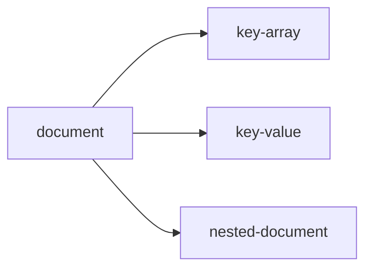
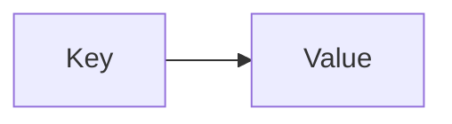
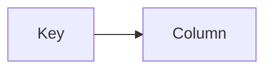
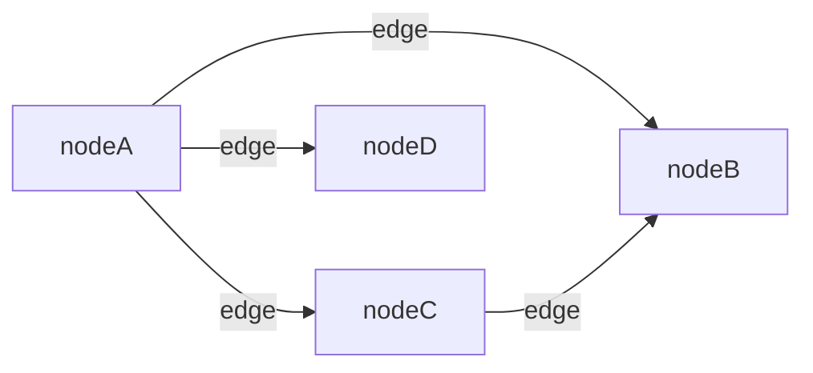

## NoSQL
### Document Database

```mermaid
flowchart LR
document-->key-array & key-value & nested-document
```
### Key-Value Store
Simplest option
* Redis

```mermaid
flowchart LR
Key-->Value
```
### Wide-Column Store
For queries in large datasets

```mermaid
flowchart LR
Key-->Column
```
### Graph Stores

```mermaid
flowchart LR
nodeA--edge-->nodeB & nodeC & nodeD
nodeC--edge-->nodeB
```
[Quora source](https://qr.ae/pG6ksX)

