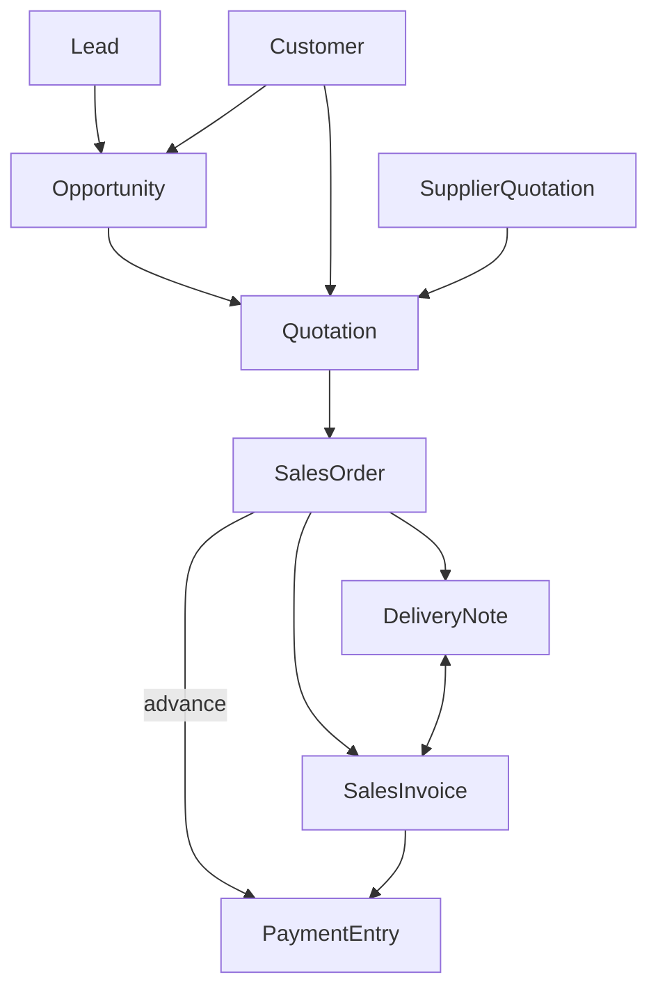
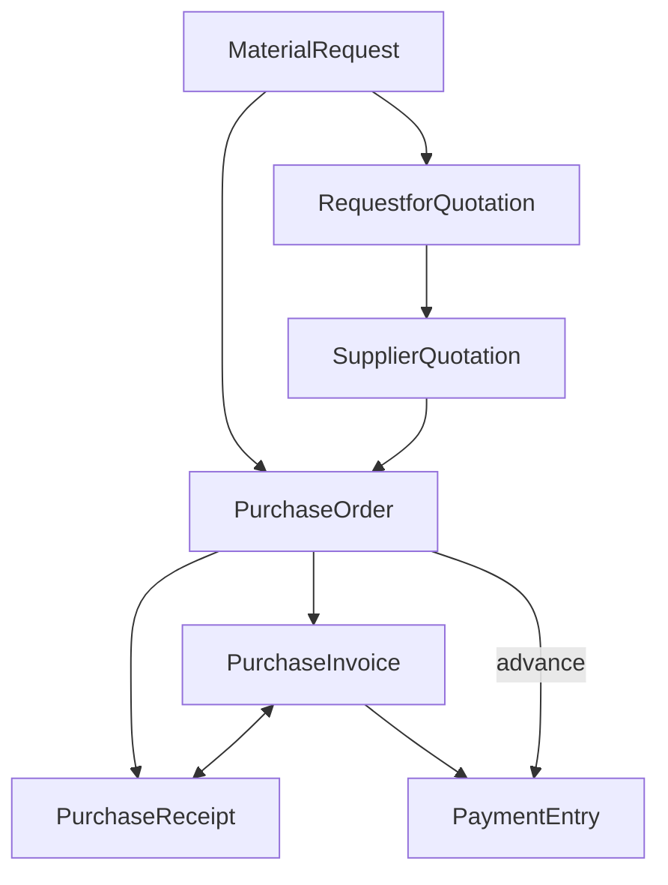
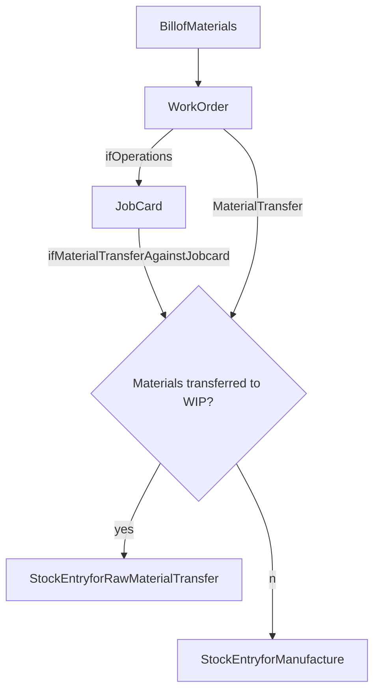
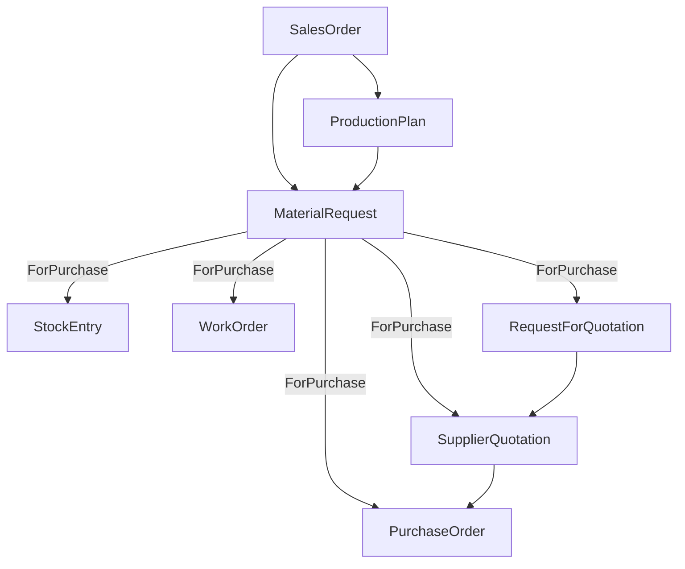

# Doctype Functions
## Prices
### Price List
MultiSelect Buying, Selling, and price UOM dependent bool  
Applicable by country  

### Item Price List
Select Item code, UOM, packing unit  

* **Price List**  
 Select Price List, supplier, and buying or selling (also batch no.)
 Currency and Rate
 Valid times

### Pricing Rule
 Applied to Item Code, Item Group, Brand, or Transaction. Able to be mixed  
 Discount via price or product  
 Applicable to certain warehouse  
 Cumulative and coupon booleans  
 
* **Party Information**  
 Multiselect buying, selling  
Applicable for relation (customer, supplier, etc.)  

 **Quantity and Amount**  
 Determined via min and max qtys  

 **Period Settings**  
 Valid times  

 **Price Discount Schemes**  
 Set margin   
 Discount method - amount, rate, or percentage - selected for one price list

 **Advanced Settings**  
 Threshold (quantity), Priority, Condition via Python  
 For multiple pricing rules that are applicable, priority gets set

--------------------
## Selling

### Lead
Contact info           
Lead Source, campaign    
Lead owner, status     

* **Follow Up**  
 Person, date, expiry  

 **Address & Contact**  
 Address info

### Opportunity
Select Opp. From Cust or Lead  
Select Source  
Select Type; sales, maintenance etc.  
Converted by salesperson  
Select Sales State  
Exp. Close Date  
* **Follow Up**
 Next contact by salesperson
 Contact date, to discuss

 **Sales**
 Opportunity amnt, probability  
 Items bool - with table  
 
 **More Inforamtion**
 Company

### Sales Order
Customer
Select Order Type; sails, maint., etc  
Date and Delivery Date  
Customer PO  

* **Currency and Price List**
 Select Price List

 **Select Source Warehouse**

 **Scan Barcode / Items**

 **Taxes and Charges**
 Select Tax Cat., Shipping Rule  
 Sales tax & Charge list

 **Addl Discount & Coupon Codes**

 **Payment Terms**

 **T&C**

 **More Info**
 Is Internal Cust bool  
 Project  
 Source  
 Campaign  

 **Billing and Delivery Status**
 Commission

 **Sales Team**

 **Auto Repeat**
### Quotation
Get items from Opportunity  
Select customer or lead  
Select order type (sales, maintenance, shopping cart? )  

* **Items**   

 **Taxes and Charges**
 Tax category, shipping rule
 Sales tax + charges  

 **Addl Discount & Coupon Code**  

 **Payment Terms**  

 **T&C**  

 **Print**  

 **More Info**  
 Campaign, Source, Supplier Quotation

------------------------
## Buying

### Supplier
Supplier Name, Supplier Group, Country, Supplier Type, Default Bank Acct, PAN, Tax ID, IRS 1099 box, tax cat, tax withholding cat, is transporter box, is internal supplier box, allow PI creation w/out PO box, allow PI creation without purchase receipt box, disabled box

* **Currency and Price List**
 Billing Currency, Price List

 **Credit Limit**
 Default Payment Terms template, block supplier checkbox

 **Primary Address and Contact Detail**
 Supplier primary contact, primary address, mobile no. email id

 **Default Payable Accounts**
 Accounts child table

 **More Information**
 website, details, print, is frozen box

### Request For Quotation
Get Items from Material Request, Opportunity, or Possible Supplier  
Enter req'd date  

* **Suppliers**
 Suppliers list  
 Items list

 **Email Details**  
 Select template  

 **T&C**  

 **Print**

### Supplier Quotation
Get items from Material Request or RFQ  

* **Address and Contact**  
 Supplier, POC  
 
 **Currency and Price List**
 Select each

 **Taxes and Charges**
 Tax cat., shipping rule

 **Addl Discount**

 **T&C**

 **Print Settings**

 **More Info**
 Status, Is subcontracted? bool

### Purchase Order
Select Supplier and Date  
if Supplier, fetch items based on default supplier  
Tax witholding bool  

* **Address and Contact**
 Supplier address, POC  
 Company Shipping and Billing addresses

 **Currency and Price LIst**
 Select Price List

 **Subcontracting**  
 Supply Raw Materials bool

 **Scan Barcode, Set Target Warehouse**

 **Items**  
 Tax category, shipping rule  
 Purchase taxes, charges  

 **Addl Discount**

 **Payment Terms**

 **Order Status**

 **T&C**

 **Printing Settings**

 **Subscription Select**

 **More Info**  
 Is Internal Supplier bool
## Manufacturing

### Operation  
Name, Default Workstation, bool is corrective operation  

* **Job Card**
 bool create card based on batch size
 quality inspection template

 **Sub Operations**
 List:
 Operation, operation time  

 **Operation Description**

### Workstation  
Workstation name, production capacity

* **Operating Costs**
 Electricity, Rent, Consumable, Wages, per hour

 **Working Hours**
 Holiday list  
 Working hours

 **Description**
 Description

### Work Order
Select Item to mfr, BOM no, qty, sales order project

* **Settings**  
 bools allow alternate item, use multilevel bom, skip mat transfer to wip warehosue, update consumed material cost in project

 **Warehouses**  
 Select: source warehouse, wip warehouse, target warehouse, scrap warehouse

 **Required Items**  
 List: Item code, src warehosue, reqd qty, transferred qty, consumed qty  

 **Time**
  Planned / actual dates, delivery date

  **Operations**  
  list: operation, BOM, status, workstation, completed, description, times - start, end, total

  **More Info**
  Stock uom, material request

### Job Card
Select Operation, Workstation, Employee

* **Timing Detail**
 List: employee, from time, to time, time in mins, completed qty

 Total completed qty  

 **Raw Materials**  
 List: item, source warehouse, reqd qty  

 **Scrap Items**  
 List: item code, item name

 **More Info**  
 FG qty from transferred raw mats, requested qty, status, remarks
 

### Item
Item Code, Item Name, Item Group, from Hub bool, UOM  
bools: disabled, allow alternate, main. stock, include in manuf., is fixed asset  
Opnening stock, valuation rate, standard selling rate,

* **Description**
 Brand, description

 **Barcodes**
 list

 **Inventory**
 shelf life, EOL, default mat req type, val method, warrty, weight per, weight UOM  

 **Auto re-order**
 check in, requuest for, rerorder level, reorder qty, mat.req

 **Units of Measure**
 UOM, conversion factor

 **Serial Nos and Batches**
 bool Has Batch No, Has Serial No

 **Variants**
 bool Has Variants  
 if yes: 
	var based on item attribute OR mfr
	attributes list:  
	attribute, val

 **Sales, purchase, accoutning details**
 list
 default company, warehouse, price list

 **Purchase, replenishment details**
 Default purchase unit of measure  
 Min order qty  
 Safety stock  
 Lead time in days  
 bool is cust provided

 **Supplier Details**
 drop ship bool  
 Supplier Items list:
	supplier, part number

 **Foreign Trade Details**
 Country of Origin, customs tariff number

 **Sales Details**
 Default sales Unit of Measure, Max Discount  
 bools: is sales item, grant commission

 **Deferred Revenue**
 bool enable deferred revenue

 **Deferred Expense**
 bool enable deferred expense

 **Customer Details**
 List Customer Items:  
 Customer name, group, ref code

 **Item Tax**
 List:
 tax template, tax category, Valid from, min & max net rate

 **Inspection Criteria**
 Quality Inspection Template  
 bools Inspection req'd before purchase, inspection req'd before delivery  

 **Manufacturing**
 bool supply raw material for purchase

 **Hub publishing details**
 bool publish in hub
 Select Hub Warehouse  
 bool synced with hub 

### BOM
Assign Item Name
bool - isActive, isDefault, allowAlternateItem, sub-assyRateViaBOM
Select project

* **Currency and Price List**
 Rate based on Select valuation rate, last purchase rate, price list
 
 **With Operations**
 if bool  
 Transfer material against work order or job card
 Select routing
 List Operations

 **Materials**
 Qualtiy inspection bool
 Select quality inspection template, BOM level
 List Items
 
 **Scrap**
 List scrap items

 variants bool

 **Website**
 show in website bool  
 Route   

 
### Material Request
Get Items from BOM, Sales Order, or Product Bundle  
Select purpose
* **Warehouse**
 Target warehouse

 **Items**
 Barcode, etc.

 **Print**

 **T&C**

 ### Request for Quotation
 Select Series  
 Required Date, status  
 Suppliers table  
 Items table  
 
* **Email Details**
 Salutation, Email Template, Subject, Preview Email  

 **T&C**  

 **Print Settings**

### Production Plan
Get Items from mat req or Sales Order  
Select company  

* **Select Items to Manufacture**
 Items, get subassembly items

 **Material Requirement Planning**
 Incl nostock item bool  
 Incl subcontract item bool  
 Incl safety stock in req qty calc bool  
 Ignore existing proj. qty bool  
 Select warehouse
 Get raw mats. for prod action
 raw mat listing  

 **Other Details**
 Total planned, produced qty  
 Status

### Stock Entry
 Stock Entry Type - mfr, material transfer, etc.  
 Date & time
 bools edit time, inspection required, from BOM; if BOM:
	Bom No, for Qty, Action get items, bool use multilevel bom
 Default src warehouse  
 Scan barcode  
 List - Items:
 source warehouse, target warehouse, item code, qty, basic rate

 **Accounting Dimensions**  
 Select Project
 
 **Print Settings** 

 **More Info**
 Is opening - y/n  
 Remarks
 

[Map](/assets/images/2022-01-10-12-56-45.png)

# New Installation Import order
https://discuss.erpnext.com/t/what-order-to-setup-a-business-on-erpnext/72574/2
Gender #( I18N)
Salutation #( I18N)
User
Blogger
Blog_Post
Logo
Chart_of_Accounts_Importer
Company
Tax_Category
Sales_Taxes_and_Charges_Template
Email_Domain
Email_Account
Social_Login_Key
Fiscal_Year
Warehouse_Type
Warehouse
Web_Page
Homepage_Section
UOM
Supplier_Group
Supplier
Custom_Script
Item_Attribute
Item_Group
Item
Item_Price
Customer
Sales_Invoice
Payment_Entry
Workstation
Operation
Routing
BOM
Employee
Widgets #(my app)
Stock_Entry
Work_Order
Print_Format