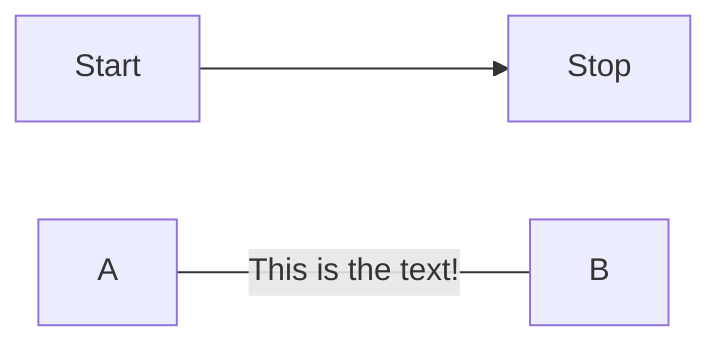
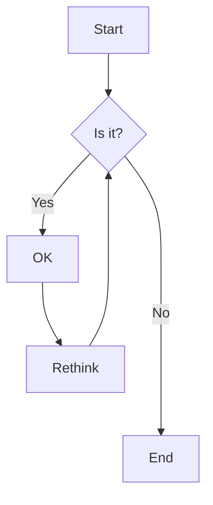

## [About](https://mermaid-js.github.io/mermaid/#/)  
### [Flowcharts](https://mermaid-js.github.io/mermaid/#/./flowchart?id=flowcharts-basic-syntax)  


```
flowchart LR
    Start --> Stop
    A-- This is the text! ---B
```


```
flowchart TD
    A[Start] --> B{Is it?}
    B -->|Yes| C[OK]
    C --> D[Rethink]
    D --> B
    B ---->|No| E[End]
```
